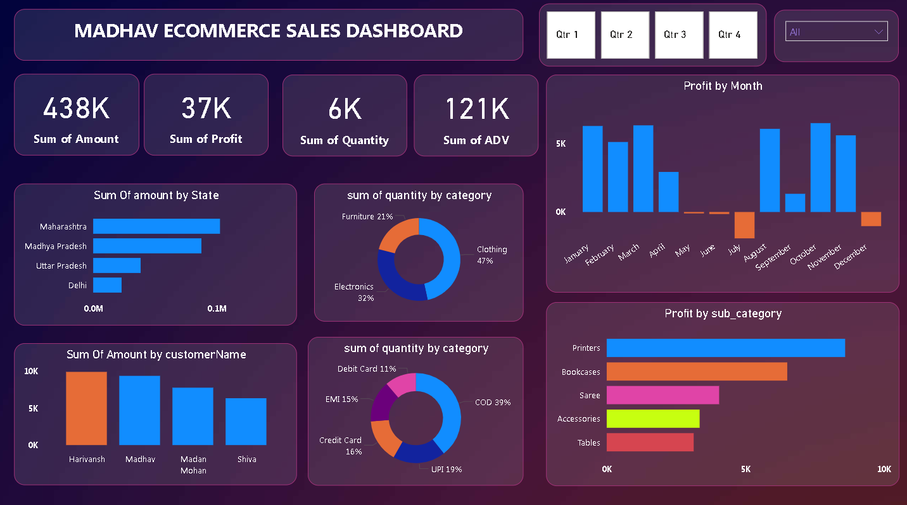

# madhav-ecommerce-sales-dashboard

- dashboad.png 
This repository contains a Power BI project for analyzing and tracking online sales data for Madhav eCommerce.

## Key Features:
- Interactive dashboard with complex parameters for drill-down analysis.
- Customized visualizations including bar, pie, donut, clustered, scatter, line, and area charts.
- Power Query for data extraction and transformation.
- DAX for complex calculations to enhance data analysis.

## Files:
- `Madhav_eCommerce_Sales.pbix`: Power BI dashboard file.
- `Data`: Sample datasets used in the project (if any).
- `Documentation`: Additional documentation or data source information.

## How to Use:
1. Download the `.pbix` file.
2. Open the file in Power BI Desktop to explore the dashboard and data.

## Technologies Used:
- Power BI
- Power Query
- DAX

- dashboad.png 
